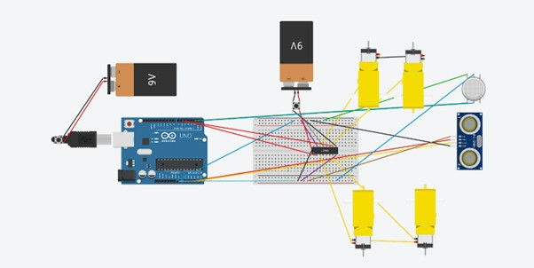

# On the Road to Autonomy: Smart Obstacle-Avoiding & Firefighting Car

## Problem Statement

Autonomous navigation and fire safety are critical areas in modern robotics and smart systems. Autonomous vehicles can navigate complex environments without human intervention, reducing accidents and improving efficiency. Simultaneously, automated firefighting systems can detect and respond to fires faster than humanly possible, minimizing damage and saving lives. This project combines both concepts into a single, integrated robotic car.

## Hardware Used

*   **Arduino Uno:** The microcontroller brain of the project.
*   **Ultrasonic Sensor (HC-SR04):** For detecting obstacles and measuring distance.
*   **Servo Motor (SG90):** To rotate the ultrasonic sensor for wider area scanning.
*   **MQ-2 Smoke Sensor:** To detect smoke and potential fire hazards.
*   **L293D Motor Driver:** To control the DC motors for car movement.
*   **Relay Module:** To switch the high-voltage water pump on/off.
*   **Submersible Water Pump:** The actuator for the firefighting system.
*   **Power Supply:** To provide power to the entire system.

## Circuit Diagram

Here is the circuit diagram for the project setup:

## Software/Compilation

*   **Language:** The code is written in Arduino C++.
*   **IDE:** Compiled and uploaded using the Arduino IDE.

## Setup Instructions

1.  **Wiring:** Connect all the components according to the circuit diagram provided above.
2.  **IDE Setup:** Ensure you have the Arduino IDE installed.
3.  **Library:** Add the `Servo.h` library if it's not already included in your IDE.
4.  **Upload:** Connect the Arduino Uno to your computer via USB, select the correct board and port in the IDE, and upload the code from `src/main.ino`.

## Working

### Obstacle Avoidance System

The car uses an ultrasonic sensor mounted on a servo motor to navigate its environment. 
1.  The car moves forward by default.
2.  The ultrasonic sensor continuously measures the distance to objects in front.
3.  If an obstacle is detected within a predefined threshold, the car stops.
4.  The servo motor scans the left and right sides to find the clearest path.
5.  The car then turns towards the direction with more open space and continues moving.

### Firefighting System

The MQ-2 smoke sensor continuously monitors the air for smoke particles.
1.  If the smoke level exceeds a certain threshold, it signals a potential fire.
2.  The Arduino activates the relay module, which turns on the submersible water pump.
3.  The pump dispenses water to extinguish the fire.
4.  Once the smoke level drops, the pump is turned off.

## Results

*   **Prototype Photos:** View the project photos in the `/images` directory.
*   **Demo Videos:** Watch the car in action in the `/media` directory.

## Future Work

*   **IoT Integration:** Connect the car to the internet to send real-time alerts and be controlled remotely.
*   **Sensor Fusion:** Combine data from multiple sensors (e.g., infrared, cameras) for more robust navigation.
*   **AI-Powered Navigation:** Implement a machine learning model for smarter pathfinding and object recognition.

## References

*   [Cite relevant research papers or articles here.]
